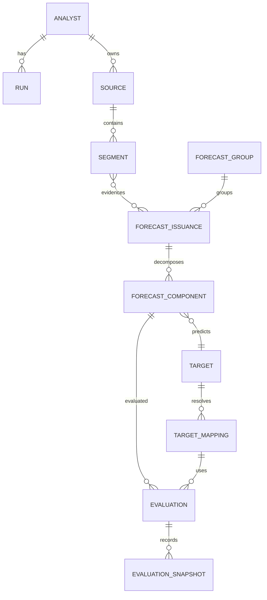

# データモデル

## 1. 設計原則

- 原文、AI解釈、評価を分離する。
- 予想表明を基本件数とし、予想グループと構成予想を別に持つ。
- 過去実績と現在予想を別の正本にしない。
- 集計・グラフ・Markdownは再生成可能な派生データとする。
- 全エンティティに固定ID、作成日時、更新日時、バージョンを持たせる。

## 2. 関係図



## 3. 主要エンティティ

### ANALYST

```text
analyst_id
canonical_name
aliases
affiliation
specialties
official_youtube
official_blog
official_x
profile_notes
created_at
updated_at
```

### RUN

```text
run_id
analyst_id
period_start
period_end
evaluation_as_of
selected_media
focus_targets
ai_environment
model_configuration
status
created_at
```

### SOURCE

```text
source_id
analyst_id
medium
url
external_source_id
title
publisher_or_channel
published_at
recorded_at
retrieved_at
evidence_level
raw_file_path
raw_hash
acquisition_status
source_relation
original_source_id
```

`source_relation`は `original`、`clip_of`、`repost_of`、`quotation_of`、`summary_of`、`syndicated_copy_of` 等。

### SEGMENT

```text
segment_id
source_id
sequence_number
timestamp_start
timestamp_end
raw_start_offset
raw_end_offset
raw_text
normalized_text
speaker_label
speaker_name
speaker_confidence
attribution_basis
review_status
```

### FORECAST_ISSUANCE

```text
forecast_issuance_id
analyst_id
forecast_group_id
made_at
publicly_available_at
forecast_type
commitment_strength
evidence_level
extraction_confidence
human_readable_summary
relation_to_previous
current_status
```

一つの予想表明が複数セグメントに根拠を持てるよう、中間テーブルで原文引用・位置・役割を関連付ける。

### FORECAST_GROUP

```text
forecast_group_id
analyst_id
central_thesis
first_issued_at
latest_issued_at
current_stance
reaffirmation_count
revision_count
withdrawal_status
```

### FORECAST_COMPONENT

```text
forecast_component_id
forecast_issuance_id
parent_component_id
sequence_number
prediction_form
direction
time_expression_raw
time_source
normalized_start
normalized_end
time_precision
magnitude_value
magnitude_unit
magnitude_operator
condition_root_id
scenario_probability
```

### CONDITION

```text
condition_id
forecast_component_id
parent_condition_id
logic_operator
condition_text
normalized_condition
evaluation_method
condition_status
evidence
```

### TARGET

```text
target_id
raw_label
canonical_name
target_type
ticker
security_code
exchange
currency
aliases
valid_from
valid_to
```

### TARGET_MAPPING

```text
target_mapping_id
target_id
mapping_method
evaluation_instruments
weights
benchmark
knowledge_cutoff
source_evidence
proposal_model
review_result
adjudication_result
mapping_status
mapping_hash
locked_at
```

`mapping_status`は `unresolved`、`proposed`、`verified`、`corrected`、`multiple_proxies`、`unresolvable`。

### MARKET_SERIES

```text
market_series_id
provider
symbol
currency
adjustment_type
frequency
start_date
end_date
retrieved_at
raw_cache_path
data_hash
quality_status
```

### EVALUATION

```text
evaluation_id
forecast_component_id
target_mapping_id
evaluation_method_version
evaluation_as_of
start_price
end_price
current_price
period_high
period_low
actual_return
total_return
base_currency_return
benchmark_return
excess_return
direction_result
timing_result
magnitude_result
early_realization_result
evaluation_status
unevaluable_reason
```

### EVALUATION_SNAPSHOT

```text
evaluation_snapshot_id
evaluation_id
snapshot_at
status
interim_return
max_favorable_excursion
max_adverse_excursion
first_realization_at
days_early_or_late
notes
```

### PROMPT_EXECUTION

```text
prompt_execution_id
run_id
prompt_id
prompt_version
environment
model
input_files
output_file
executed_at
validation_status
```

### SEARCH_LOG

```text
search_log_id
run_id
medium
period_start
period_end
queries
search_tool
model
executed_at
result_scope
found_count
adopted_count
excluded_count
inaccessible_count
notes
```

### WORKFLOW_TASK

```text
task_id
run_id
executor_type
prerequisites
inputs
outputs
status
recommended_rank
blocking_reason
started_at
completed_at
```

## 4. 派生ビュー

- `all_forecasts_view`
- `active_forecasts_view`
- `completed_forecasts_view`
- `forecast_progress_view`
- `analyst_performance_by_target_view`
- `analyst_performance_by_horizon_view`
- `current_consensus_view`
- `research_coverage_view`
- `unresolved_items_view`

## 5. ID例

```text
A0001          分析対象者
RUN-20260720-001
SRC-000001     情報源
SEG-000042     発言セグメント
FCI-000010     予想表明
FCG-000004     予想グループ
FCC-000012     構成予想
TGT-000003     予測対象
MAP-000003     評価用マッピング
EVAL-000012    評価
```

## 6. 更新・削除

- `raw`原文は更新しない。
- 誤ったAI出力は旧版を保持し、新版を登録する。
- 評価結果は基準日・方法バージョンごとに保存する。
- 原則として物理削除せず、無効・置換・撤回等の状態を使用する。
- DB移行前にバックアップを作成する。

