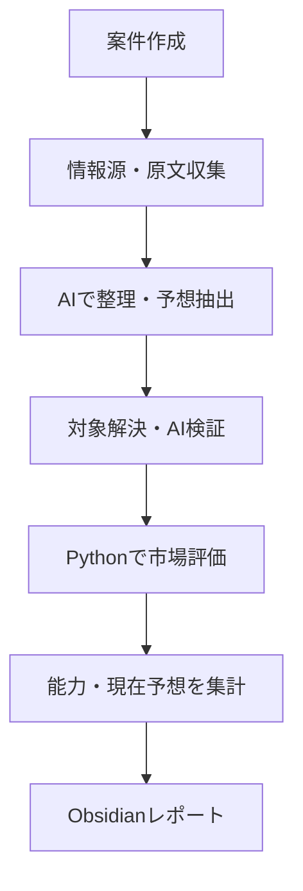
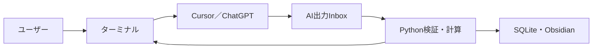
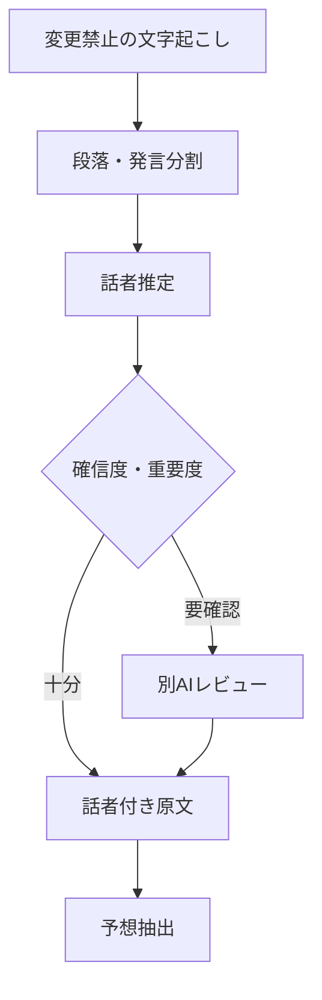
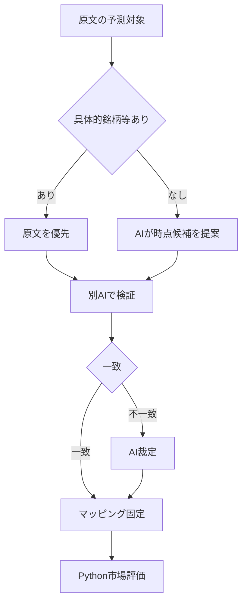
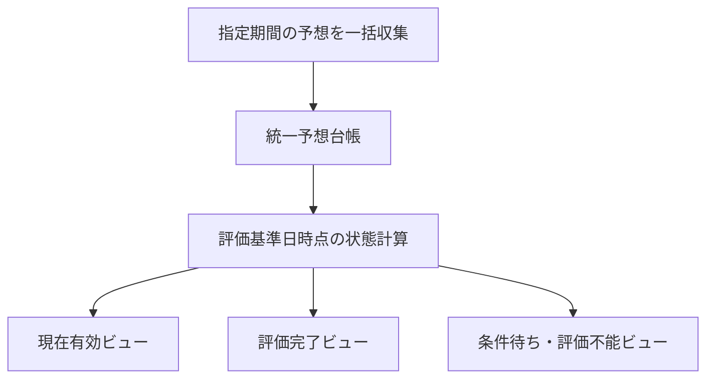
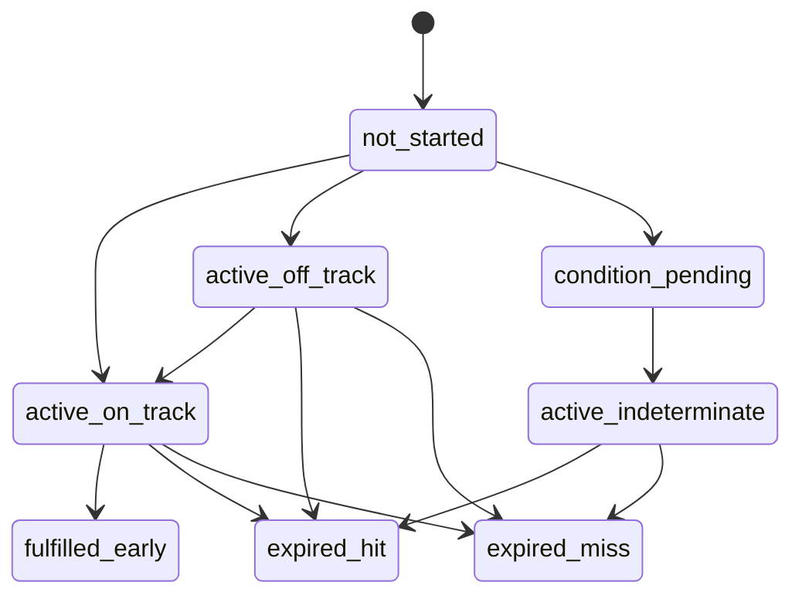
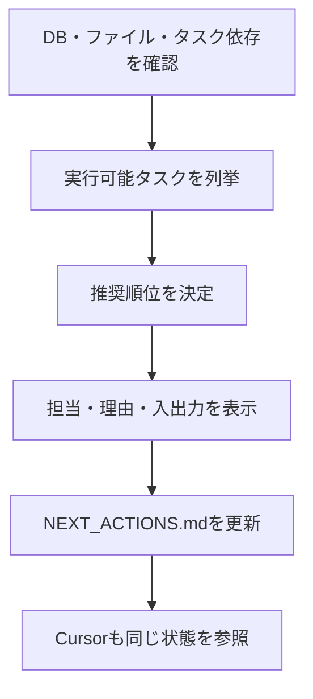
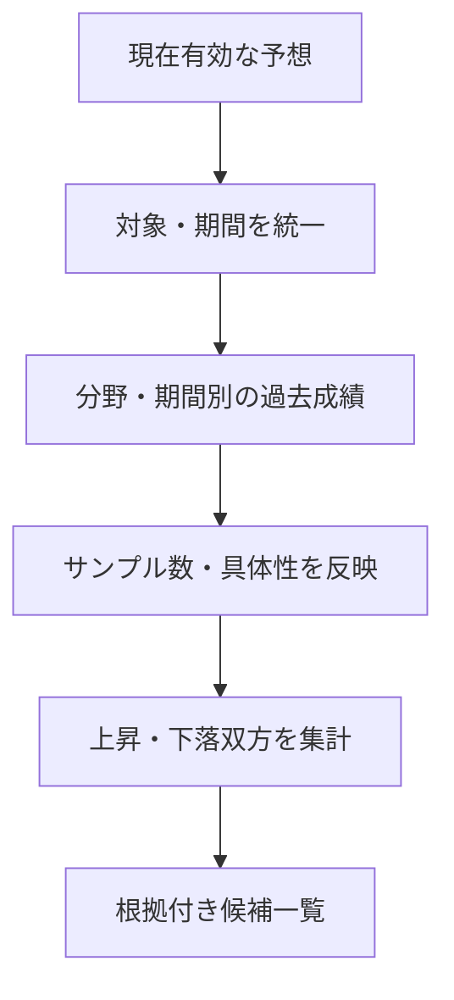

# ワークフロー・構成図

## 1. 全体フロー

## 2. AIとPython

## 3. YouTube処理

## 4. 予測対象解決

## 5. 統一収集と派生表示

過去実績用と現在予想用に収集期間を分けない。

## 6. 状態遷移の概略

撤回、置換、評価不能は各評価中状態から遷移可能とする。

## 7. 次行動案内

## 8. 現在予想から上昇候補

## 9. 可視化

### タイムライン

- 横軸：時期。
- 縦軸：分析対象者。
- フィルター：予測対象。
- 緑＋上矢印：上昇。
- 赤＋下矢印：下落。
- 点の大きさ：具体性。
- 線の長さ：予想期間。

### ヒートマップ

- 横軸：時期。
- 縦軸：予測対象。
- 分析対象者：フィルター。
- 色と記号を併用する。

3次元グラフは採用せず、2次元図とフィルターに分解する。

