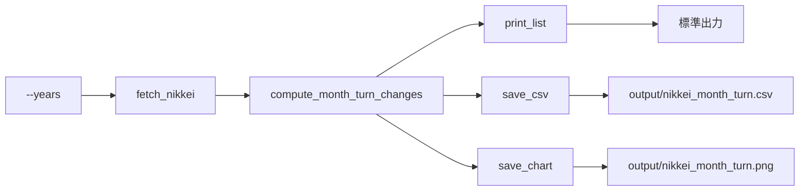

# 日経平均 月末・月初変動率ツール 仕様書

## 1. フォルダ構成

```
nikkei_month_turn/
├── .venv/                 # 仮想環境（python -m venv .venv で作成）
├── app.py                  # メインスクリプト（取得・計算・表示・CSV/画像保存）
├── requirements.txt       # 依存パッケージ
├── output/                 # 出力先（実行時に自動作成）
│   ├── nikkei_month_turn.csv   # 変動率一覧 CSV
│   └── nikkei_month_turn.png   # 変動率グラフ PNG
├── README.md               # 作業手順（仮想環境構築〜実行）
└── Specification.md       # 本仕様書
```

## 2. システム構成

### 2.1 入力

| 項目 | 内容 |
|------|------|
| ティッカー | 日経平均株価 `^N225`（yfinance） |
| 期間 | 過去 N 年（デフォルト 10 年）。コマンドライン引数 `--years` で変更可能。 |

### 2.2 処理フロー

1. **データ取得**: yfinance で `^N225` の日次終値を指定期間分取得する。
2. **取引日判定**: 各月について  
   - **月末3日間**: その月のカレンダー上「末日−2 日」〜「末日」に含まれる取引日のうち、**最後の取引日**を採用。  
   - **月初3日間**: 翌月の **1〜3 日**に含まれる取引日のうち、**最初の取引日**を採用。
3. **変動率計算**: 各月ごとに  
   `変動率（%） = (月初終値 − 月末終値) / 月末終値 × 100`
4. **リスト化**: 年月・月末日・月初日・終値・変動率を 1 行 1 月でまとめる。

### 2.3 出力

| 出力 | 形式 | 保存先・内容 |
|------|------|--------------|
| リスト表示 | 標準出力 | 各月の「月末日→月初日」と変動率（%）をテキストで表示 |
| CSV | UTF-8（BOM 付き） | `output/nikkei_month_turn.csv`。Excel で開ける。 |
| 画像 | PNG | `output/nikkei_month_turn.png`。横軸: 年月、縦軸: 変動率（%）の棒グラフ。 |

## 3. プログラム構成

### 3.1 モジュール・関数（app.py）

| 関数名 | 役割 |
|--------|------|
| `fetch_nikkei(years)` | yfinance で ^N225 を過去 years 年分取得。Date / Close の DataFrame を返す。 |
| `last_trading_day_in_last_3_days(df, year, month)` | 指定月の「月末3日間」の最後の取引日の Date と Close を返す。 |
| `first_trading_day_in_first_3_days(df, year, month)` | 指定月の「月初3日間」の最初の取引日の Date と Close を返す。 |
| `compute_month_turn_changes(df)` | 全月について上記の変動率を計算し、DataFrame で返す。 |
| `print_list(result)` | 変動率一覧を標準出力に表示。 |
| `save_csv(result, out_dir)` | DataFrame を CSV で output に保存。 |
| `save_chart(result, out_dir)` | 変動率の棒グラフを PNG で output に保存。 |
| `main()` | 引数解析 → 取得 → 計算 → 表示・保存の一括実行。 |

### 3.2 データフロー



### 3.3 CSV 列定義

| 列名 | 説明 |
|------|------|
| year_month | 対象月（YYYY-MM） |
| last_date_end_of_month | 月末3日間の最後の取引日（YYYY-MM-DD） |
| first_date_start_of_month | 翌月月初3日間の最初の取引日（YYYY-MM-DD） |
| close_end | 月末側の終値 |
| close_start | 月初側の終値 |
| change_pct | 変動率（%） |

## 4. 依存関係

- Python 3.10 以上を想定（型ヒントで `tuple[...]` を使用）。
- パッケージ: `yfinance>=0.2.0`, `pandas>=2.0.0`, `matplotlib>=3.7.0`（`requirements.txt` 参照）。

## 5. エラー・不足データ

- yfinance が空を返した場合: メッセージを表示して終了（exit 1）。
- 特定月で「月末3日間」または「月初3日間」に取引日が 1 日も無い場合: その月はスキップし、結果の行には含めない。
