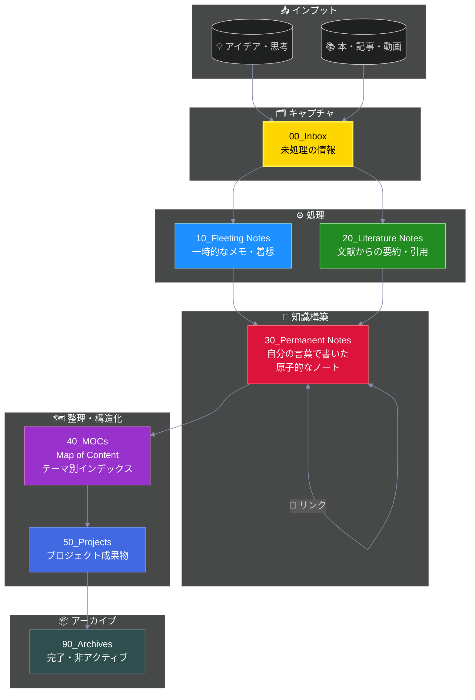

# 📥 Inbox

**外部から入ってくる情報**の一時置き場。未処理・未分類のもの。

## Zettelkasten ワークフロー

> **📍 現在地: Inbox** - 外部情報の入り口です

---

## 何を入れる？
- 後で読むWebクリップ・記事
- 後で見るYouTube動画のURL
- ChatGPT会話ログ（とりあえず保存）
- メールや会話から得た情報
- 他アプリからの転送メモ

## Fleeting Notesとの違い
- **Inbox** = 外部から来た「未読ボックス」
- **Fleeting** = 自分の頭から出た「アイデアメモ」

## ルール
- 週1回は整理（理想は毎日）
- 処理したら適切なフォルダへ移動
