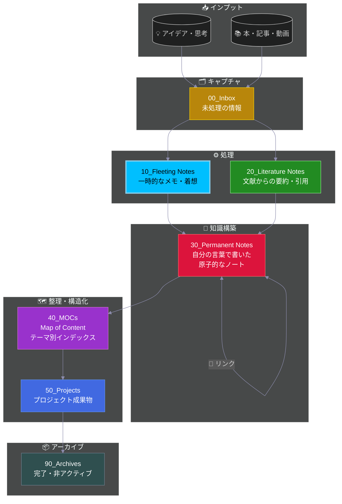

# 💭 Fleeting Notes

**自分の頭から出てきた**アイデアやひらめきを記録する場所。

## Zettelkasten ワークフロー

> **📍 現在地: Fleeting Notes** - 自分のアイデアの発生源です

---

## 何を入れる？
- ふと思いついたアイデア
- 読書中・動画視聴中のひらめき
- ChatGPTとのブレストで出た**自分の**発想
- 「こうじゃないか？」という仮説
- 将来書きたいテーマのメモ

## Inboxとの違い
- **Fleeting** = 自分の頭から出た「アイデアメモ」
- **Inbox** = 外部から来た「未読ボックス」

## ルール
- 完璧を求めない（雑でOK）
- 思いついたらすぐ書く
- 定期的にPermanent Notesへ発展させる
