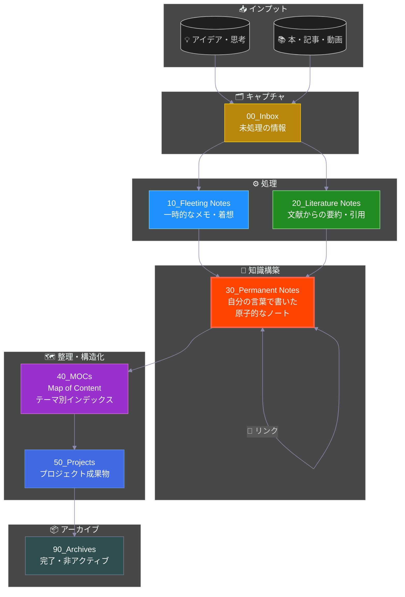

# 🧠 Permanent Notes

Zettelkastenの本体。永続的な知識ノートを保管する場所です。

## Zettelkasten ワークフロー

> **📍 現在地: Permanent Notes** - Zettelkastenの心臓部、知識が蓄積される場所です

---

## 使い方
- 1つのノートに1つのアイデア（Atomic Notes）
- 他のノートへのリンクを積極的に作る
- 自分の言葉で、未来の自分に説明するように書く

## ルール
- 完全な文章で書く（箇条書きではなく）
- 他のノートとの関連性を意識する
- タイトルは内容を表す主張・質問にする

## ファイル命名規則（推奨）
- `YYYYMMDDHHMMSS タイトル.md`（タイムスタンプ）
- または意味のあるタイトルのみ
