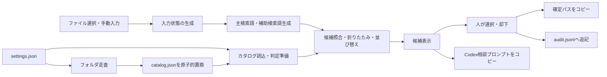

# 実装計画：OneDrive業務フォルダ向け「保存先レコメンダー」MVP 0

作成日：2026-07-31

基準資料：

- `要件定義_OneDrive保存先レコメンダー.md`
- Claudeによる最終レビュー（MVP 0の実装着手可）

この文書は実装順、最小構成、検証方法を定める。機能要件の正本は要件定義書とし、差異がある場合は要件定義書を優先する。

---

## 1. 実装方針

- `outlook_google_sync`とはコード、設定、保存データを共有しない独立プログラムにする
- Windows上の個人利用だけを対象にする
- Python 3.12、Tkinter、Outlook COMを用いる
- 外部通信、AI API、データベース、常駐処理は設けない
- 判定ロジックは、GUIやOutlook COMから分離した副作用のない関数を中心にする
- OneDriveはフォルダ名の読み取りだけを行い、ファイルを列挙・読込・変更しない
- 実装中も、OneDrive上のフォルダやファイルを自動作成・移動・削除しない
- 正常系の画面は1画面に収め、設定画面や診断ログ画面を追加しない
- 実行ファイル化やインストーラー作成はMVP 0に含めず、仮想環境と起動用スクリプトで利用する

Python 3.12を選ぶ理由：

- このPCへ導入済みで、Tkinter 8.6を利用できる
- Python 3.14を既定環境として使わず、プロジェクト専用の仮想環境へ依存関係を固定できる
- Outlook COM用の`pywin32`は現時点のPython 3.12環境に未導入のため、専用仮想環境で導入・検証する

---

## 2. プロジェクト配置

リポジトリ直下へ、次の独立プロジェクトを新設する。

```text
onedrive_destination_recommender/
├─ README.md
├─ pyproject.toml
├─ run_app.bat
├─ src/
│  └─ onedrive_destination_recommender/
│     ├─ __init__.py
│     ├─ main.py
│     ├─ app.py
│     ├─ settings.py
│     ├─ catalog.py
│     ├─ terms.py
│     ├─ ranking.py
│     ├─ msg_reader.py
│     ├─ audit.py
│     ├─ session.py
│     └─ codex_prompt.py
└─ tests/
   ├─ unit/
   │  ├─ test_settings.py
   │  ├─ test_catalog.py
   │  ├─ test_terms.py
   │  ├─ test_ranking.py
   │  ├─ test_msg_reader.py
   │  ├─ test_session.py
   │  ├─ test_audit.py
   │  └─ test_codex_prompt.py
   ├─ integration/
   │  ├─ test_msg_reader.py
   │  └─ test_gui.py
```

固定の`tests/fixtures/`は作らない。テストデータはテストコード内の合成文字列と、`tmp_path`へ生成する合成フォルダだけにする。

増やさないもの：

- `services`、`repositories`、`use_cases`等の多層ディレクトリ
- データベース、マイグレーション
- 汎用プラグイン機構
- 独自のログ基盤
- 設定スキーマ用の外部ライブラリ
- PDF・Office・画像・CADの本文解析ライブラリ

---

## 3. 依存関係

実行時依存は次の範囲に限定する。

- `pywin32`
  - ローカルMSGをOutlook COMで読み取り専用に開く

開発時依存：

- `pytest`
- `ruff`

TkinterはPython標準添付のものを使う。MVP 0のファイル投入はTkinter標準のファイル選択ダイアログだけとし、D&D用の依存関係や独自実装を追加しない。

`pywin32`は`msg_reader`内で必要になった時点で遅延importする。未導入またはOutlookを利用できない場合はMSG解析失敗として扱い、MSGファイル名だけで候補検索を続ける。手動検索とファイル単体の経路は`pywin32`へ依存させない。

---

## 4. 最小データモデル

外部のモデルライブラリを使わず、標準ライブラリの`dataclass`で必要な項目だけを表す。

### 4.1 Settings

- `current_year_root`
- `previous_year_root`
- `pending_root`
- `candidate_count`
- `excluded_folder_names`

### 4.2 InputState

- 種別：`manual`、`msg`、`files`
- 元ファイルの絶対パス一覧
- 入力ファイル名一覧
- 自動生成した主検索語
- 現在の主検索語
- 補助検索語
- MSG解析状態
- 自動検索語だけで候補0件だったか

入力種別は拡張子が`.msg`か否かで自動判定する。

- 画面が保持する入力状態は常に1件だけとする
- MSGは1件だけ受け付ける
- 複数MSG、またはMSGとその他ファイルの混在選択は受け付けず、再選択を案内する
- MSG以外を複数選択した場合は、全ファイルを1案件にまとめる
- 新しい入力を選択した場合は、現在の入力状態を置き換える

### 4.3 Catalog

`catalog.json`は次だけを保存する。

- `scanned_at`
- `folder_count`
- `folders`：絶対パスの配列

今年度・昨年度の区別と相対パスは、読込時に`settings.json`の年度ルートから算出する。スキップ件数は更新処理の戻り値として画面へ表示するだけで、永続化しない。

### 4.4 PreparedFolder

カタログまたは設定が変わった時に1回だけ作る、メモリ上の判定準備データとする。

- 年度区分：今年度／昨年度
- 相対パス
- 絶対パス
- 正規化済み相対パス

`catalog.json`へ保存せず、検索語の入力変更時には再作成しない。

### 4.5 Candidate

- 年度区分：今年度／昨年度
- 相対パス
- 絶対パス
- 並び替え用の主検索語一致数
- 並び替え用の補助検索語一致数
- 表示用の一致主検索語
- 表示用の一致補助検索語（最大3語）

### 4.6 AuditRecord

- 日時
- 入力ファイル名一覧
- 並び替え1位のパス
- 判断種別
- 確定パス
- カタログ最終走査日時
- 手動検索語を使用したか
- 自動検索語だけで候補0件だったか
- 補助検索語が上位10件の並び順を変えたか

MSG本文、添付内容、検索語全文、Codex相談プロンプトは含めない。

---

## 5. 処理の分離



判定処理は次の順序を固定する。

判定前に、カタログまたは設定が変わった時だけ、各フォルダの年度、相対パス、正規化済み相対パスを作る。

検索語の入力変更時は次の順序を固定する。

1. 正規化済み主検索語・補助検索語を作る
2. 相対パス上の一致数を算出する
3. 主検索語一致0件を除外する
4. 同年度内で祖先・子孫を折りたたむ
5. 同年度・同じ親の兄弟を折りたたむ。親へ置き換える際は、並び替え用の主一致数を子候補から引き継ぎ、補助一致数と表示用の主・補助一致語を親の相対パスに対して再計算する
6. 「年度と相対パス」の組で重複排除する
7. 今年度、昨年度の順に並べる
8. 同年度内を主一致数、補助一致数、相対パスの順に並べる
9. 設定された件数まで表示する

Audit処理から判定処理を呼ぶことはあっても、判定処理から過去のAuditを読む経路は作らない。

---

## 6. ランタイムファイルの扱い

保存場所：

```text
%LOCALAPPDATA%\OneDriveDestinationRecommender\
├─ settings.json
├─ catalog.json
└─ audit.jsonl
```

実装規則：

- `settings.json`は読込だけとし、アプリから編集しない
- `catalog.json`は同じディレクトリの一時ファイルへ完全に書き、`os.replace`で置換する
- 走査や書込みに失敗した場合は既存カタログを維持する
- `audit.jsonl`は確定1件につきUTF-8 JSONを1行追記する
- 診断ログファイルや本文の一時ファイルは作らない
- テストでは本番のランタイム領域を使わず、`tmp_path`へ差し替える
- 公開リポジトリへ実業務のMSG、メール本文、添付内容を保存しない
- 本文整形テストは合成した文字列で行う
- Outlook COM結合テストは環境変数`ODR_TEST_MSG_PATH`で指定したリポジトリ外のMSGだけを使い、未指定時はスキップする

---

## 7. GUIの最小構成

Tkinterのメイン画面1つに限定する。

1. 対象フォルダとカタログ状態
2. 「フォルダ構成を更新」
3. 「ファイルを選択」
4. 選択ファイル一覧
5. 編集可能な主検索語入力欄
6. MSG解析状態と補助照合使用状態
7. 候補一覧
8. 「選択パスを確定・コピー」
9. 「保存先未定」
10. 「却下」
11. 「Codex相談用プロンプトをコピー」
12. 確定パスと新規フォルダ命名例

候補一覧は標準の`ttk.Treeview`を使い、列は一致主検索語、一致補助検索語、絶対パスだけにする。候補の色分け、スコア表示、信頼度表示、詳細ダイアログは追加しない。

カタログ走査の実測は未温約3.5秒、温約0.3秒だったため、MVP 0では複雑な進捗画面を作らない。走査中は更新ボタンを無効化し、状態表示を更新して同期実行する。実装後の実測で操作不能時間が著しく増えた場合だけ、走査をワーカースレッドへ移す。

---

## 8. 実装順

### Step 0：開発環境と依存関係の確認

- Python 3.12の仮想環境を作る
- `pywin32`と開発依存を導入する
- Tkinter起動と、リポジトリ外のMSGを使ったOutlook COMの項目取得を個別に確認する
- `pywin32`を読み込めない場合でもパッケージとTkinter画面を起動できることを確認する
- 依存バージョンを`pyproject.toml`へ固定する

完了条件：

- 空のTkinter画面を起動できる
- ローカルMSGを読み取り専用で開閉できる
- `pywin32`を読み込めない環境でも、パッケージとTkinter画面を起動できる

### Step 1：設定とカタログ

- ランタイムパスを決める
- `settings.json`を読込・検証する
- 年度ルートを深さ制限なしで走査する
- 完全一致の除外フォルダと配下をスキップする
- アクセス拒否、パス長超過等による個別の列挙失敗をスキップする
- シンボリックリンクとジャンクションは収録せず、リンク先を走査しない
- `catalog.json`を原子的に置換する

完了条件：

- 受け入れ条件「機能1」の深さ制限なし走査・収録件数・最終走査日時と、「安全性1・5」を自動テストまたは手動テストで確認できる
- 「機能1」の画面反映はStep 5で確認する

### Step 1.1：レビュー指摘の反映

- Windowsの大文字小文字を同一視し、今年度・昨年度ルートの同一指定と入れ子指定を拒否する
- 個別列挙失敗の原因表現を、アクセス拒否だけでなくパス長超過等を含むものへ改める
- 実パスを出力・保存せず、Step 1で発生した少数をスキップに未収録の子フォルダがないか一度だけ確認する

完了条件：

- 年度ルートの同一・双方の入れ子・Windowsの大文字小文字差を単体テストで拒否できる
- 少数をスキップが候補の欠落を生じさせていないことを読み取り専用で確認できる

### Step 2：検索語と判定コア

- ファイル名・手動入力の正規化を実装する
- 候補照合を実装する
- 祖先折りたたみ、兄弟折りたたみ、重複排除、並び替えをこの順で実装する
- 合成した小規模フォルダツリーで境界条件をテストする
- 実フォルダ名を模した`週報`シナリオをテストする

完了条件：

- 受け入れ条件「機能3・6・7」をGUIなしで再現できる
- 機能3は、合成した補助検索語リストを判定関数へ直接渡して確認する

### Step 2.1：判定準備の再利用

- カタログまたは設定が変わった時だけ、年度、相対パス、正規化済み相対パスを算出する
- 検索語の入力変更時は、準備済みフォルダを再利用する
- 手動検索語の小数表現等を拡張子として削除しないよう、拡張子除外をファイル名相当の末尾へ限定する
- カタログと年度設定の不一致は`RankingError`とし、Step 5でカタログ更新案内へ変換する

完了条件：

- 同じ準備済みフォルダへ検索語を複数回適用しても、年度判定とパス正規化が再実行されない
- Step 2と候補結果が変わらず、打鍵ごとの判定時間が画面操作を妨げない水準になる

### Step 3：MSG読込

- `.msg`を拡張子で自動判定する
- `pywin32`は関数内で遅延importし、import失敗とOutlook COM失敗を通常のMSG解析失敗へ変換する
- Outlook COMで件名、本文、添付ファイル名を読み取る
- 本文の簡易整形と2,000文字制限を、文字列から文字列を返す純粋関数として実装する
- `image`＋数字の画像添付を除外する
- 解析失敗時はMSGファイル名だけで継続する
- 本文と本文由来語がディスクへ書かれないことをテストする
- Outlook COM結合テストは疎通と項目取得だけに限定し、本文整形規則は合成文字列のユニットテストで確認する

完了条件：

- 受け入れ条件「機能2」「安全性6」を確認できる

### Step 3.1：MSG境界の安全化

- MSG本文を返す型と読取関数を内部APIに限定し、公開APIを検索語、取得可否、件数、警告だけにする
- Outlook COMを開く処理だけを`OutlookUnavailableError`へ変換し、呼び出し側の処理エラーをMSG解析失敗へ誤変換しない
- 選択後にMSGが消えた場合とMSG以外のパスが渡された場合は、Step 5で例外を捕捉して再選択を案内する

完了条件：

- 生の件名・本文・添付ファイル名を返すAPIが公開一覧に含まれない
- MSGを開いた後に呼び出し側で発生した例外が、その型のまま伝播する

### Step 4：AuditとCodex相談

- 候補選択、保存先未定、却下のAuditを1行追記する
- 補助検索語あり／なしの上位10件を比較する
- 固定テンプレートからCodex相談プロンプトをメモリ上で生成する
- ユーザーの明示操作を受けた場合だけ、固定プロンプトをクリップボードへコピーする関数を用意する。添付案内は画面表示だけとする
- プロンプト生成時は入力ファイルの存在確認を行わず、選択後に移動・削除されても案内とプロンプトを表示する
- ボタンとの接続はStep 5で行い、Step 4ではTkinterへ依存させない

完了条件：

- 受け入れ条件「機能9・10」「安全性3・4」を確認できる

### Step 5：1画面GUIへ統合

- 設定・カタログ状態と「フォルダ構成を更新」を接続する
- ファイル選択と手動検索を接続する
- 選択後にMSGが消えた場合とMSG以外のパスが渡された場合は`FileNotFoundError`・`ValueError`を捕捉し、再選択を案内して処理を続行する
- 単一の入力状態と選択ファイル一覧を接続する
- 入力変更時の候補再計算を接続する
- カタログと年度設定が一致しない場合は`RankingError`を捕捉し、「フォルダ構成を更新」を案内する
- 候補確定、保存先未定、却下、パスコピーを接続する
- 起動時の設定・フォルダ・カタログ不備を案内する

完了条件：

- 受け入れ条件「機能1」の画面反映と「機能4・5・8」を画面操作で確認できる
- 入力処理の失敗後も、次の手動検索またはファイル選択を受け付けられる

### Step 6：受け入れ確認

- 要件定義書§20の機能10件、安全性6件を順番に確認する
- 自動化できる項目は`pytest`へ固定する
- OneDrive、Outlook、クリップボードを使う項目は手動確認記録を残す
- 保存先未定が存在しないケースは、一時領域内の`settings.json`で`pending_root`だけを実在しないパスにして確認し、OneDrive上のフォルダを操作しない
- 一時的な`LOCALAPPDATA`を使って、`settings.json`不在・不正、今年度フォルダ不在、昨年度フォルダ不在、保存先未定不在、カタログ不在の起動時案内を確認する
- READMEへ導入、起動、設定、利用、年度切替、Auditを使った改善相談手順を書く

完了条件：

- 全16項目に合否と確認方法が記録されている
- OneDrive上の変更が発生していない

---

## 9. 受け入れ条件とテストの対応

| 要件定義§20 | 主な確認先 | 方法 |
|---|---|---|
| 機能1 | `test_catalog.py`、実環境走査 | 自動＋手動 |
| 機能2 | `test_terms.py`、`test_msg_reader.py` | 自動＋Windows結合 |
| 機能3 | `test_ranking.py` | 自動 |
| 機能4 | 判定コア、GUI | 自動＋手動 |
| 機能5 | 判定コア、GUI | 自動＋手動 |
| 機能6 | `test_ranking.py` | 自動 |
| 機能7 | `test_ranking.py` | 自動 |
| 機能8 | GUI、クリップボード、一時設定 | 自動＋手動 |
| 機能9 | `test_codex_prompt.py`、GUI | 自動＋手動 |
| 機能10 | `test_audit.py` | 自動 |
| 安全性1 | 実環境走査前後 | 手動 |
| 安全性2 | ネットワーク切断状態 | 手動 |
| 安全性3 | `test_audit.py` | 自動 |
| 安全性4 | `test_ranking.py` | 自動 |
| 安全性5 | `test_catalog.py` | 自動 |
| 安全性6 | `test_terms.py`、一時領域確認 | 自動 |

GUIの見た目そのものを大量の自動テスト対象にせず、判定・保存・プロンプト生成をGUI外でテストする。

---

## 10. 実装前確認の現状

2026-07-31時点で確認済み：

- `020_FY_CURRENT`が存在する
- `020_FY_CURRENT\（Pending）未分類`が存在する
- `020_FY_CURRENT\（Output）定例成果物`が存在する
- `%LOCALAPPDATA%\OneDriveDestinationRecommender\settings.json`が存在し、必須5項目と3つのパスを検証済み
- サンプルMSGをOutlook COMで読み取り専用に開き、件名、本文、添付一覧を取得できる
- 今年度・昨年度の読み取り専用走査は、除外後非公開件数のフォルダ、スキップなし
- 走査時間は未温約3.5秒、温約0.3秒

Step 1実装後の再確認（2026-07-31）：

- 現行のフォルダ構成では、除外後非公開件数のフォルダ、個別列挙不可は少数
- 走査時間は未温4.003秒、温0.407秒
- `catalog.json`の項目は`scanned_at`、`folder_count`、`folders`の3つだけ
- 保存したカタログと直後の再走査結果が一致し、年度ルート外、除外名を含むパス、重複はいずれも0件
- `catalog.json`はLocalAppDataへ保存し、OneDrive上のファイル・フォルダは変更していない

Step 1.1実装後の再確認（2026-07-31）：

- 今年度・昨年度ルートの同一指定、双方の入れ子指定、Windowsの大文字小文字差を拒否する検証を追加した
- 個別列挙不可は少数は、いずれも深い末端フォルダだった
- 長いパス形式による読み取り専用の再確認では対象はいずれも子フォルダ0件で、候補の欠落はなかった
- 実パス名、ファイル名、フォルダ名は診断結果へ出力・保存していない

Step 2実装後の確認（2026-07-31）：

- NFKC、小文字化、拡張子除外、記号・全角半角境界の分割、1文字語と補助検索語の短い数字の除外を純粋関数として実装した
- 年度・相対パスの組をキーに、主一致0件除外、祖先折りたたみ、兄弟折りたたみ、重複排除、年度別並び替えを仕様順に実装した
- 合成ツリーで、同年度だけの祖先探索、兄弟3件の折りたたみ、年度ルートへの折りたたみ禁止、年度をまたぐ重複保持、折りたたみ行の表示語再計算を確認した
- 単体テスト46件が成功し、Outlook COM結合テスト1件は通常実行から除外された
- 実カタログ非公開件数に`20XX0101_定例資料_サンプル.pptx`相当の3語を適用し、複数候補、今年度の`（Output）定例成果物`が1位、昨年度候補も残ることを読み取り専用で確認した。判定時間は約206ミリ秒だった

Step 2.1実装後の確認（2026-08-01）：

- 実カタログ非公開件数の判定準備は約117.6ミリ秒で、カタログまたは設定変更時だけ実行する
- 同じ準備済みデータを20回利用した判定は、平均4.49ミリ秒、最大5.58ミリ秒だった
- `20XX0101_定例資料_サンプル.pptx`相当の複数候補、今年度1位、昨年度候補保持という結果はStep 2から変わっていない
- `3.5inch`と`Rev1.2_図面`を途中の拡張子として誤削除せず、`.pdf`と複合拡張子は検索語から除外できる

Step 3実装後の確認（2026-08-01）：

- `.msg`の自動判定、`pywin32`の遅延import、Outlook COMによる件名・本文・添付ファイル名の読み取りを実装した
- 返信・転送履歴、引用行、署名区切り、URL、メールアドレス、電話番号、Teams会議案内を合成本文から除外し、整形後2,000文字に制限できる
- `image`＋数字かつ対象画像拡張子の添付名だけを除外し、添付実体は展開していない
- 一部項目が読めない場合は取得済み項目を使い、Outlook COMを利用できない場合はMSGファイル名だけへフォールバックする
- 単体テスト57件と、リポジトリ外の実MSGを使ったOutlook COM結合テスト1件が成功した
- 実MSGから検索語をメモリ上だけで生成し、主検索語10件、補助検索語6件、全項目取得成功を内容非表示で確認した
- MSG本文、本文由来語、添付内容はファイルまたはログへ保存していない
- ジャンクション除外後の実フォルダ走査は1回目3.624秒、2回目0.886秒で、収録非公開件数、少数をスキップだった

Step 3.1・Step 4実装後の確認（2026-08-01）：

- MSG本文を返す型と関数を内部APIに限定し、Outlook COMを開いた後の呼び出し側例外を誤変換しないことをテストした
- 候補選択、保存先未定、却下を同じ9項目のUTF-8 JSON 1行として追記し、入力パスからはファイル名だけを記録する
- 判定処理はAuditをimportせず、Auditの有無・内容が候補順位へ影響する経路を設けていない
- 手動検索語の利用有無と、補助検索語あり／なしの上位10件のパス順の差を純粋関数で算出する
- 手動検索、MSG、単一ファイル、複数ファイルの添付案内と固定プロンプトをメモリ上で生成し、上位候補は10件に制限する
- 単体テスト76件、リポジトリ外の実MSGを使ったOutlook COM結合テスト1件、Ruffの静的検査が成功した
- レビュワーの独立検証では整形後の補助検索語13語のうちフォルダへ一致したのは`web`だけで16件、上位10件の変化は0件だった。2週間運用後の削除判断に使う初期値として記録する

Step 5実装後の確認（2026-08-01）：

- 単一の`InputState`で手動検索、MSG 1件、単一・複数ファイルを置き換え方式で管理し、MSG混在選択を拒否する
- 設定・年度ルート・保存先未定・カタログの起動時不備を、設定保存先とREADME参照先を含むダイアログへ接続した
- カタログ最終走査日時をUTCからローカル時刻へ変換し、収録件数、更新時のスキップ件数とともに表示する
- ファイル選択、検索語編集、候補10件、補助照合状態、候補確定、保存先未定、却下、Audit追記、パスコピーを1画面へ接続した
- Codexの添付案内と固定プロンプトを常時表示し、ボタンでは固定プロンプトだけをコピーする。自動送信・保存は行わない
- 単体テスト86件、WindowsのGUI統合テスト1件、実MSGのOutlook COM結合テスト1件、Ruffの静的検査が成功した
- 実ランタイムのカタログ非公開件数を読み込み、手動検索`定例 サンプル`で複数候補を表示し、起動時不備通知0件であることをパス非表示で確認した

実装とともに確認する項目：

- 個別サブフォルダで列挙失敗が発生した場合の継続
- 選択パスをエクスプローラや保存ダイアログへ貼り付ける操作
- 一時的な`LOCALAPPDATA`を使った起動時不備通知

---

## 11. 実装中に追加しないもの

- PDF・Office本文抽出
- OCR、CAD解析
- AI API、Codex自動送信
- 自動保存、自動移動、自動フォルダ作成
- 信頼度、100点採点
- Auditによる自動学習
- カタログ差分・履歴
- 初回設定ウィザード
- フォルダ選択画面
- ファイルのD&D
- 複数MSGの一括投入と案件切替
- 詳細なエラーコード体系
- インストーラー、Windowsサービス、自動更新

追加案が出た場合は、その場で実装せず、MVP 0の受け入れに必要かを要件定義書へ照らして判断する。

---

## 12. MVP 0完了の定義

- 要件定義書§20の機能10件、安全性6件を満たす
- Python 3.12の専用仮想環境から`run_app.bat`で起動できる
- 本文・添付内容・プロンプトがランタイムファイルへ残らない
- 実行前後でOneDrive上のファイル・フォルダに変化がない
- READMEだけで設定、起動、通常利用、年度切替、Auditを使った改善相談を再現できる
- 2週間の試用を開始できる

MVP 0完了後は新機能を直ちに追加せず、2週間のAudit結果を確認してから、昨年度候補とMSG本文補助照合を残すか判断する。
