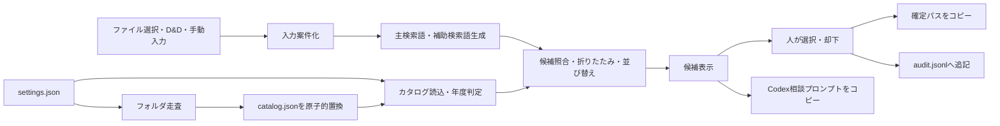

# 実装計画：OneDrive業務フォルダ向け「保存先レコメンダー」MVP 0

作成日：2026-07-31

基準資料：

- `要件定義_OneDrive保存先レコメンダー.md`
- Claudeによる最終レビュー（MVP 0の実装着手可）

この文書は実装順、最小構成、検証方法を定める。機能要件の正本は要件定義書とし、差異がある場合は要件定義書を優先する。

---

## 1. 実装方針

- `outlook_google_sync`とはコード、設定、保存データを共有しない独立プログラムにする
- Windows上の個人利用だけを対象にする
- Python 3.12、Tkinter、Outlook COMを用いる
- 外部通信、AI API、データベース、常駐処理は設けない
- 判定ロジックは、GUIやOutlook COMから分離した副作用のない関数を中心にする
- OneDriveはフォルダ名の読み取りだけを行い、ファイルを列挙・読込・変更しない
- 実装中も、OneDrive上のフォルダやファイルを自動作成・移動・削除しない
- 正常系の画面は1画面に収め、設定画面や診断ログ画面を追加しない
- 実行ファイル化やインストーラー作成はMVP 0に含めず、仮想環境と起動用スクリプトで利用する

Python 3.12を選ぶ理由：

- このPCへ導入済みで、Tkinter 8.6を利用できる
- Python 3.14を既定環境として使わず、プロジェクト専用の仮想環境へ依存関係を固定できる
- Outlook COM用の`pywin32`は現時点のPython 3.12環境に未導入のため、専用仮想環境で導入・検証する

---

## 2. プロジェクト配置

リポジトリ直下へ、次の独立プロジェクトを新設する。

```text
onedrive_destination_recommender/
├─ README.md
├─ pyproject.toml
├─ run_app.bat
├─ src/
│  └─ onedrive_destination_recommender/
│     ├─ __init__.py
│     ├─ main.py
│     ├─ app.py
│     ├─ settings.py
│     ├─ catalog.py
│     ├─ terms.py
│     ├─ ranking.py
│     ├─ msg_reader.py
│     ├─ audit.py
│     └─ codex_prompt.py
└─ tests/
   ├─ unit/
   │  ├─ test_settings.py
   │  ├─ test_catalog.py
   │  ├─ test_terms.py
   │  ├─ test_ranking.py
   │  ├─ test_audit.py
   │  └─ test_codex_prompt.py
   ├─ integration/
   │  ├─ test_msg_reader.py
   │  └─ test_runtime_catalog.py
   └─ fixtures/
```

増やさないもの：

- `services`、`repositories`、`use_cases`等の多層ディレクトリ
- データベース、マイグレーション
- 汎用プラグイン機構
- 独自のログ基盤
- 設定スキーマ用の外部ライブラリ
- PDF・Office・画像・CADの本文解析ライブラリ

---

## 3. 依存関係

実行時依存は次の範囲に限定する。

- `pywin32`
  - ローカルMSGをOutlook COMで読み取り専用に開く
- `tkinterdnd2`
  - ローカルファイルのD&DをTkinterへ渡す

開発時依存：

- `pytest`
- `ruff`

TkinterはPython標準添付のものを使う。`tkinterdnd2`は実装開始時にPython 3.12で最小動作確認を行い、動作した版を固定する。互換性が確認できない場合は独自のWin32 D&D実装を追加せず、ファイル選択だけを先に完成させたうえで、D&DをMVP 0から外すかユーザーへ確認する。

---

## 4. 最小データモデル

外部のモデルライブラリを使わず、標準ライブラリの`dataclass`で必要な項目だけを表す。

### 4.1 Settings

- `current_year_root`
- `previous_year_root`
- `pending_root`
- `candidate_count`
- `excluded_folder_names`

### 4.2 InputCase

- 案件ID（メモリ上だけ）
- 種別：`manual`、`msg`、`files`
- 元ファイルの絶対パス一覧
- 入力ファイル名一覧
- 自動生成した主検索語
- 現在の主検索語
- 補助検索語
- MSG解析状態
- 自動検索語だけで候補0件だったか

入力種別は拡張子が`.msg`か否かで自動判定する。

- MSGは1件ずつ独立した案件にする
- MSG以外を複数投入した場合は、全ファイルを1案件にまとめる
- MSGとその他ファイルを同時投入した場合は、各MSGを独立案件、その他ファイル群を1案件にする
- 画面内の案件一覧から、現在表示する案件を選ぶ

### 4.3 Catalog

`catalog.json`は次だけを保存する。

- `scanned_at`
- `folder_count`
- `skipped_count`
- `folders`：絶対パスの配列

今年度・昨年度の区別と相対パスは、読込時に`settings.json`の年度ルートから算出する。

### 4.4 Candidate

- 年度区分：今年度／昨年度
- 相対パス
- 絶対パス
- 並び替え用の主検索語一致数
- 並び替え用の補助検索語一致数
- 表示用の一致主検索語
- 表示用の一致補助検索語（最大3語）

### 4.5 AuditRecord

- 日時
- 入力ファイル名一覧
- 並び替え1位のパス
- 判断種別
- 確定パス
- カタログ最終走査日時
- 手動検索語を使用したか
- 自動検索語だけで候補0件だったか
- 補助検索語が上位10件の並び順を変えたか

MSG本文、添付内容、検索語全文、Codex相談プロンプトは含めない。

---

## 5. 処理の分離



判定処理は次の順序を固定する。

1. 正規化済み主検索語・補助検索語を作る
2. 相対パス上の一致数を算出する
3. 主検索語一致0件を除外する
4. 同年度内で祖先・子孫を折りたたむ
5. 同年度・同じ親の兄弟を折りたたむ
6. 「年度と相対パス」の組で重複排除する
7. 今年度、昨年度の順に並べる
8. 同年度内を主一致数、補助一致数、相対パスの順に並べる
9. 設定された件数まで表示する

Audit処理から判定処理を呼ぶことはあっても、判定処理から過去のAuditを読む経路は作らない。

---

## 6. ランタイムファイルの扱い

保存場所：

```text
%LOCALAPPDATA%\OneDriveDestinationRecommender\
├─ settings.json
├─ catalog.json
└─ audit.jsonl
```

実装規則：

- `settings.json`は読込だけとし、アプリから編集しない
- `catalog.json`は同じディレクトリの一時ファイルへ完全に書き、`os.replace`で置換する
- 走査や書込みに失敗した場合は既存カタログを維持する
- `audit.jsonl`は確定1件につきUTF-8 JSONを1行追記する
- 診断ログファイルや本文の一時ファイルは作らない
- テストでは本番のランタイム領域を使わず、`tmp_path`へ差し替える

---

## 7. GUIの最小構成

Tkinterのメイン画面1つに限定する。

1. 対象フォルダとカタログ状態
2. 「フォルダ構成を更新」
3. D&D領域と「ファイルを選択」
4. 投入案件一覧
5. 編集可能な主検索語入力欄
6. MSG解析状態と補助照合使用状態
7. 候補一覧
8. 「選択パスを確定・コピー」
9. 「保存先未定」
10. 「却下」
11. 「Codex相談用プロンプトをコピー」
12. 確定パスと新規フォルダ命名例

候補一覧は標準の`ttk.Treeview`を使い、列は一致主検索語、一致補助検索語、絶対パスだけにする。候補の色分け、スコア表示、信頼度表示、詳細ダイアログは追加しない。

カタログ走査の実測は未温約3.5秒、温約0.3秒だったため、MVP 0では複雑な進捗画面を作らない。走査中は更新ボタンを無効化し、状態表示を更新して同期実行する。実装後の実測で操作不能時間が著しく増えた場合だけ、走査をワーカースレッドへ移す。

---

## 8. 実装順

### Step 0：開発環境と依存関係の確認

- Python 3.12の仮想環境を作る
- `pywin32`、`tkinterdnd2`、開発依存を導入する
- Tkinter起動、D&D、Outlook COMによるサンプルMSG読込を個別に確認する
- 依存バージョンを`pyproject.toml`へ固定する

完了条件：

- 空のTkinter画面を起動できる
- ローカルMSGを読み取り専用で開閉できる
- D&Dで受け取ったローカルパスを表示できる

### Step 1：設定とカタログ

- ランタイムパスを決める
- `settings.json`を読込・検証する
- 年度ルートを深さ制限なしで走査する
- 完全一致の除外フォルダと配下をスキップする
- アクセス拒否を個別スキップする
- `catalog.json`を原子的に置換する

完了条件：

- 受け入れ条件「機能1」「安全性1・5」を自動テストまたは手動テストで確認できる

### Step 2：検索語と判定コア

- ファイル名・手動入力の正規化を実装する
- 候補照合を実装する
- 祖先折りたたみ、兄弟折りたたみ、重複排除、並び替えをこの順で実装する
- 合成した小規模フォルダツリーで境界条件をテストする
- 実フォルダ名を模した`週報`シナリオをテストする

完了条件：

- 受け入れ条件「機能3〜7」をGUIなしで再現できる

### Step 3：MSG読込

- `.msg`を拡張子で自動判定する
- Outlook COMで件名、本文、添付ファイル名を読み取る
- 本文の簡易整形と2,000文字制限を実装する
- `image`＋数字の画像添付を除外する
- 解析失敗時はMSGファイル名だけで継続する
- 本文と本文由来語がディスクへ書かれないことをテストする

完了条件：

- 受け入れ条件「機能2・3」「安全性6」を確認できる

### Step 4：AuditとCodex相談

- 候補選択、保存先未定、却下のAuditを1行追記する
- 補助検索語あり／なしの上位10件を比較する
- 固定テンプレートからCodex相談プロンプトをメモリ上で生成する
- 添付案内とプロンプトをクリップボードへコピーする

完了条件：

- 受け入れ条件「機能9・10」「安全性3・4」を確認できる

### Step 5：1画面GUIへ統合

- ファイル選択、D&D、手動検索を接続する
- 案件一覧と現在案件の切替を接続する
- 入力変更時の候補再計算を接続する
- 候補確定、保存先未定、却下、パスコピーを接続する
- 起動時の設定・フォルダ・カタログ不備を案内する

完了条件：

- 受け入れ条件「機能4・5・8」を画面操作で確認できる
- 1案件の失敗後も別案件へ切り替えて処理を継続できる

### Step 6：受け入れ確認

- 要件定義書§20の機能10件、安全性6件を順番に確認する
- 自動化できる項目は`pytest`へ固定する
- OneDrive、Outlook、クリップボードを使う項目は手動確認記録を残す
- READMEへ導入、起動、設定、利用、年度切替、Auditを使った改善相談手順を書く

完了条件：

- 全16項目に合否と確認方法が記録されている
- OneDrive上の変更が発生していない

---

## 9. 受け入れ条件とテストの対応

| 要件定義§20 | 主な確認先 | 方法 |
|---|---|---|
| 機能1 | `test_catalog.py`、実環境走査 | 自動＋手動 |
| 機能2 | `test_terms.py`、`test_msg_reader.py` | 自動＋Windows結合 |
| 機能3 | `test_ranking.py` | 自動 |
| 機能4 | 判定コア、GUI | 自動＋手動 |
| 機能5 | 判定コア、GUI | 自動＋手動 |
| 機能6 | `test_ranking.py` | 自動 |
| 機能7 | `test_ranking.py` | 自動 |
| 機能8 | GUI、クリップボード | 手動 |
| 機能9 | `test_codex_prompt.py`、GUI | 自動＋手動 |
| 機能10 | `test_audit.py` | 自動 |
| 安全性1 | 実環境走査前後 | 手動 |
| 安全性2 | ネットワーク切断状態 | 手動 |
| 安全性3 | `test_audit.py` | 自動 |
| 安全性4 | `test_ranking.py` | 自動 |
| 安全性5 | `test_catalog.py` | 自動 |
| 安全性6 | `test_terms.py`、一時領域確認 | 自動 |

GUIの見た目そのものを大量の自動テスト対象にせず、判定・保存・プロンプト生成をGUI外でテストする。

---

## 10. 実装前確認の現状

2026-07-31時点で確認済み：

- `020_FY_CURRENT`が存在する
- `020_FY_CURRENT\（Pending）未分類`が存在する
- `020_FY_CURRENT\（Output）定例成果物`が存在する
- `%LOCALAPPDATA%\OneDriveDestinationRecommender\settings.json`が存在し、必須5項目と3つのパスを検証済み
- サンプルMSGをOutlook COMで読み取り専用に開き、件名、本文、添付一覧を取得できる
- 今年度・昨年度の読み取り専用走査は、除外後非公開件数のフォルダ、スキップなし
- 走査時間は未温約3.5秒、温約0.3秒

実装とともに確認する項目：

- 要件どおりの本文整形結果
- `image`＋数字の添付名除外
- 個別サブフォルダでアクセス拒否が発生した場合の継続
- 選択パスをエクスプローラや保存ダイアログへ貼り付ける操作
- D&DライブラリのPython 3.12互換性

---

## 11. 実装中に追加しないもの

- PDF・Office本文抽出
- OCR、CAD解析
- AI API、Codex自動送信
- 自動保存、自動移動、自動フォルダ作成
- 信頼度、100点採点
- Auditによる自動学習
- カタログ差分・履歴
- 初回設定ウィザード
- フォルダ選択画面
- 詳細なエラーコード体系
- インストーラー、Windowsサービス、自動更新

追加案が出た場合は、その場で実装せず、MVP 0の受け入れに必要かを要件定義書へ照らして判断する。

---

## 12. MVP 0完了の定義

- 要件定義書§20の機能10件、安全性6件を満たす
- Python 3.12の専用仮想環境から`run_app.bat`で起動できる
- 本文・添付内容・プロンプトがランタイムファイルへ残らない
- 実行前後でOneDrive上のファイル・フォルダに変化がない
- READMEだけで設定、起動、通常利用、年度切替、Auditを使った改善相談を再現できる
- 2週間の試用を開始できる

MVP 0完了後は新機能を直ちに追加せず、2週間のAudit結果を確認してから、昨年度候補とMSG本文補助照合を残すか判断する。
