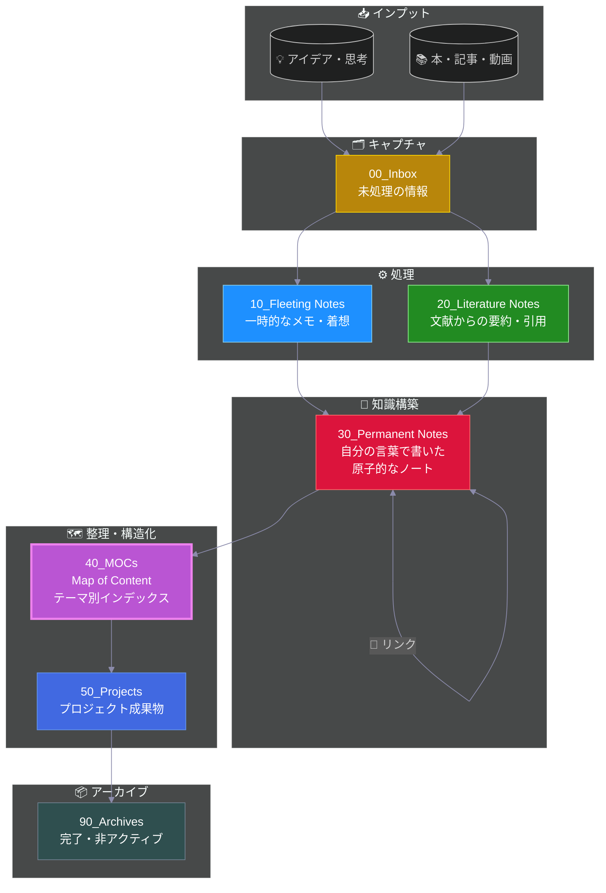

# 🗺️ Maps of Content (MOCs)

トピックごとのインデックスページを保管する場所です。

## Zettelkasten ワークフロー

> **📍 現在地: MOCs** - Permanent Notesをテーマ別に整理するマップです

---

## 使い方
- 関連するノートをテーマ別にまとめる
- ノート間のナビゲーションを容易にする
- 新しいアイデアの発見を促す

## ルール
- トピックごとに1つのMOCを作る
- 定期的に更新する
- リンク切れをチェックする

## 例
- `プログラミング MOC.md`
- `読書 MOC.md`
- `プロジェクト管理 MOC.md`
