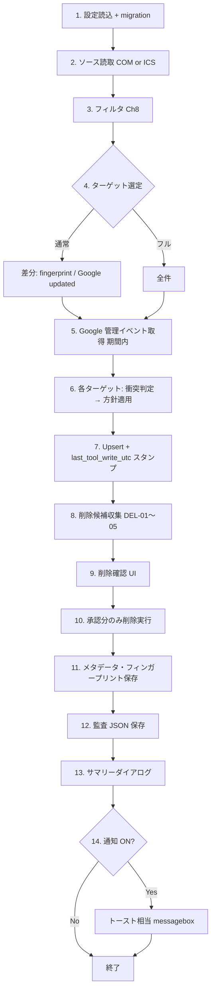
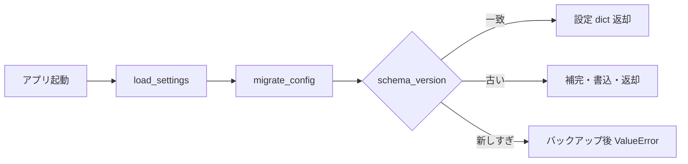
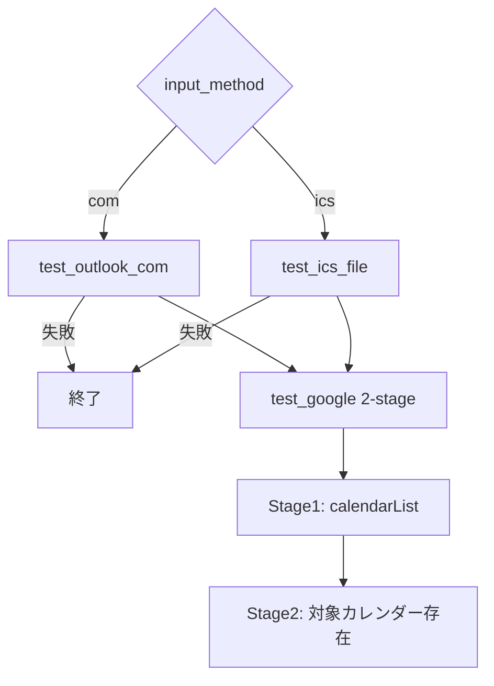
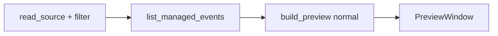
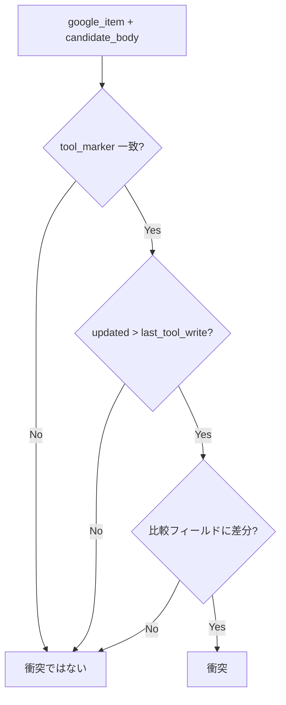
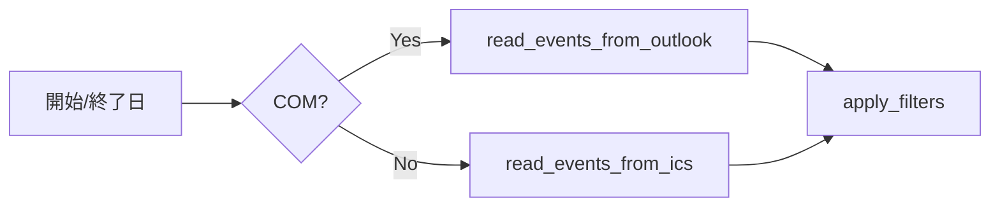

# FLOWS — Outlook→Google カレンダー同期ツール

本書は **Ch43.2** で求められる操作フローと、実装に沿った **同期パイプライン** を整理する。モジュール対応は概ね `src/outlook_google_sync/` 配下。

---

## 実行場所の統一ルール

- **最初に** `.\scripts\setup_env.bat` で仮想環境 `.venv` を作成してから、その他の CLI / GUI 起動に進む。
- `.bat` や `python` コマンドは、**`outlook_google_sync/` をカレントにした Cursor ターミナル（PowerShell）**で実行することを正規とする。
- Windows PowerShell（単体）でも同等に実行可能。
- エクスプローラから `.bat` のダブルクリック実行も可能だが、エラー追跡性の観点で非推奨。
- GUI ボタン操作（通常同期、フル同期、プレビュー、接続テスト、重複修復）はアプリ画面上で実行する。

---

## 同期パイプライン（全体）

実際の **通常同期 / 強制フル同期** は、以下の順で処理される（GUI の `_sync_events` と `SyncEngine.run` がオーケストレーション）。

---

## 1. 起動 → 設定読込（migration 含む）

**トリガー:** `MainWindow.__init__` → `load_settings()`

**処理:**

1. `runtime_dir` を確保。
2. `migrate_config(config_path())` で JSON を読み、**schema_version** を検査。
3. 未作成なら既定構造（`runtime_state`, `sync_metadata.per_source_fingerprint` 等）で初期化。
4. 古いバージョンならフィールド補完のうえ **同一ファイルへ書き戻し**。
5. 新しすぎるスキーマはバックアップのうえ例外。

**Mermaid:**

**参照:** `config/settings_store.py`, `config/migration.py`

その後、メインウィンドウが `runtime_state` を `state_data` にマージ（入力方法・詳細度・カレンダー ID 等）。

---

## 2. 接続テスト（COM / ICS / Google 2 段階）

**トリガー:** 「接続テスト」→ `connection_test()`

**順序:** 入力方法に応じ **Outlook 側 → Google 側**（Google は常に最後）。

| 段 | 条件 | 内容 |
|----|------|------|
| COM | `input_method == com` | `test_outlook_com`: MAPI 既定カレンダー疎通・件数・最小読取 |
| ICS | それ以外 | `test_ics_file`: 存在・UTF-8・VCALENDAR/VEVENT・パース・UID・期間内件数・TZ 等（Ch25 1〜11） |
| Google Stage 1 | 常時 | `list_calendars()` — トークン・calendarList |
| Google Stage 2 | `calendar_id` あり | リスト内に対象 ID があるか確認。未選択時は警告のみで Stage 1 成功扱い |

**参照:** `services/connection_test.py`, `gui/main_window.py`

---

## 3. 通常プレビュー（差分 + スナップショット）

**トリガー:** 「通常プレビュー」→ `preview_normal()`

**流れ:**

1. `read_source()` — COM/ICS 読取 → **Ch8 フィルタ**。
2. `list_managed_events(calendar_id, sd, ed)` で Google 側 **ツール管理イベント** の辞書を取得。
3. `build_preview(..., mode="normal", range_start/end)`  
   - ターゲットは `filter_diff_targets`（フィンガープリント変化・Google 上に無い・`updated > last_tool_write_utc` 等）と同等の差分ロジック。  
   - 対象外は `skip`。  
   - 対象は `create` / `update`（理由に衝突・ソース変更）。  
   - 削除候補・重複候補をアクションに追加。
4. `PreviewWindow` で表示。**PRE-SNAP-03:** 生成から 5 分超で `PreviewSnapshot.is_stale()` が真。

**参照:** `sync/preview.py`, `sync/diff_sync.py`, `gui/preview_window.py`

---

## 4. フルプレビュー（全件再評価）

**トリガー:** 「フルプレビュー」→ `preview_full()`

通常プレビューと同じくソース読取・Google 取得まで同一。`build_preview(..., mode="full")` のみ異なり、**全イベントをターゲット**として create/update を組み立てる（`full_targets` と同趣旨）。差分スキップ行がなくなる。

**参照:** `sync/preview.py`, `sync/full_sync.py`

---

## 5. 通常同期（差分同期パイプライン）

**トリガー:** 「通常同期」→ `sync("normal")`

1. `read_source()`（設定と同じフィルタ）。
2. `SyncEngine.run(..., mode="normal")`  
   - `filter_diff_targets(events, previous_fingerprints, existing)` で書込対象のみ抽出。  
   - 各件: 衝突時は方針、`upsert_event`。  
   - 削除候補リスト生成（後述 UI）。
3. メタデータの `per_source_fingerprint` 全件更新、`last_input_method` 保存、`save_settings`。
4. `save_audit`、ログ、`SummaryDialog`、`notify`（設定で ON の場合）。

**参照:** `sync/engine.py`, `sync/diff_sync.py`, `gui/main_window.py`

---

## 6. 強制フル同期（フル同期パイプライン）

**トリガー:** 「強制フル同期」→ `sync("full")`

`SyncEngine.run(..., mode="full")` で `full_targets` により **全イベントを書込対象**とする点のみ通常同期と異なる。削除候補・監査・サマリー・通知の流れは同じ。

**参照:** `sync/engine.py`, `sync/full_sync.py`

---

## 7. 衝突検知（3 条件: tool_marker + updated > last_write + フィールド差分）

**実装:** `has_conflict(google_item, candidate_body)`

| # | 条件 | 意味 |
|---|------|------|
| 1 | `extendedProperties.private.tool_marker == outlook_google_sync_v1` | 当ツール管理イベントであること |
| 2 | Google の `updated` が `last_tool_write_utc` **より新しい** | 当ツール書込後に Google 側で更新された疑い |
| 3 | `COMPARE_FIELDS`（summary, description, location, visibility, colorId, start, end）のいずれかが **正規化後不一致** | ソース想定と Google 実体が食い違う |

3 つすべて満たすとき **衝突** とみなす。満たさない場合は通常 upsert 扱い。

**方針（`conflict_policy`）:** `overwrite` / `detach_new`（旧をデタッチ後に新規 insert）/ `merge`（`merge_fields`）

**参照:** `sync/conflict.py`, `sync/engine.py`, `sync/merge.py`

---

## 8. 書込（upsert + last_tool_write_utc スタンプ）

**処理:**

1. `upsert_event`: body に `tool_marker` を設定し、`patch` または `insert`。
2. 成功後 `_stamp_last_write` で **別 patch** により `extendedProperties.private.last_tool_write_utc` を UTC タイムスタンプで更新。

衝突検知の条件 2 と整合するため、**書込直後**にスタンプする。

**参照:** `connectors/google_calendar.py`

---

## 9. 削除候補確認（DEL-01〜05 + 確認 UI）

**ルール（`select_delete_candidates`）:**

| ID | 内容 |
|----|------|
| DEL-01 | `tool_marker` が当ツールと一致する管理イベントのみ |
| DEL-02 | `range_start` / `range_end` が渡された場合、イベントが範囲 R と **重複**するものに限定（未指定時は期間フィルタなし） |
| DEL-03 | 現在ソースの `sync_key` 集合に **含まれない** |
| DEL-04 | （設計上）キー差分の前に R 重複を評価 |
| DEL-05 | R 外へ移動したイベントは、R 指定時は候補から外れる |

**UI:** `DeleteConfirmDialog` — ユーザーが承認した項目だけ `execute_deletions` → `delete_event`。

**注:** プレビュー・同期の両方で `range_start/end` を渡し、DEL-02 の期間重複条件を適用する。

**参照:** `sync/delete_candidates.py`, `sync/engine.py`, `gui/dialogs.py`

---

## 10. サマリー（同期後サマリーダイアログ）

**トリガー:** `_sync_events` 完了後、`SummaryDialog(self, res)`  
`SyncResult` の created / updated / merged / deleted / skipped / failed 等を表示。

**参照:** `gui/dialogs.py`, `models/sync_result.py`

---

## 11. 監査更新

**処理:** `save_audit(payload)` — `runtime_dir()/audit.json` に JSON 書込（mode, 各種件数、delete_candidates 数など）。

**参照:** `services/audit_store.py`, `gui/main_window.py`

---

## 12. 通知

**条件:** `runtime_state.notification_enabled` が真のとき、同期完了後 `notify("Sync", メッセージ)`（`tkinter.messagebox.showinfo`）。

**参照:** `services/notifications.py`, `gui/main_window.py`

---

## 13. 重複修復（重複検出・古い方を残す / 選択して残す）

**トリガー:** 「重複修復」→ 期間内 `list_managed_events` → `find_duplicates`（同一 `sync_key` に複数イベント）

**UI（`DuplicateRepairWindow`）:**

- **選択を残し、他を削除:** ツリーで 1 件選択し、兄弟イベントを削除。
- **古い方を残す（一括）:** 開始日時でソートし、先頭以外を削除（コメント DUP-03）。

**参照:** `sync/duplicate_repair.py`, `gui/duplicate_repair_window.py`

---

## 補足: ソース読取とフィルタ（Ch8）

プレビュー・同期の共通前処理:

入力方法が前回 `last_input_method` と COM↔ICS で変わる場合は **重複警告ダイアログ**（続行確認）。

**参照:** `sync/filters.py`, `connectors/outlook_com.py`, `connectors/outlook_ics.py`

---

## 補足: プレビューからの実行（PRE-SNAP-01）

プレビューでユーザーが承認した **create/update のイベントのみ** を抽出し、別ワーカーで `_sync_events(approved_events, mode)` を実行。スナップショット全体の再計算は行わず、承認サブセットでエンジンが動く点に注意。

**参照:** `gui/main_window.py` の `_execute_from_preview`

---

## モジュール早見表

| 関心 | 主ファイル |
|------|------------|
| 設定・migration | `config/settings_store.py`, `config/migration.py` |
| 接続テスト | `services/connection_test.py` |
| 差分/フル対象 | `sync/diff_sync.py`, `sync/full_sync.py` |
| プレビュー | `sync/preview.py` |
| エンジン | `sync/engine.py` |
| 衝突 | `sync/conflict.py`, `sync/merge.py` |
| Google API | `connectors/google_calendar.py` |
| 削除候補 | `sync/delete_candidates.py` |
| 重複 | `sync/duplicate_repair.py` |
| 監査・通知 | `services/audit_store.py`, `services/notifications.py` |
| GUI | `gui/main_window.py`, `gui/preview_window.py`, `gui/dialogs.py`, `gui/duplicate_repair_window.py` |
